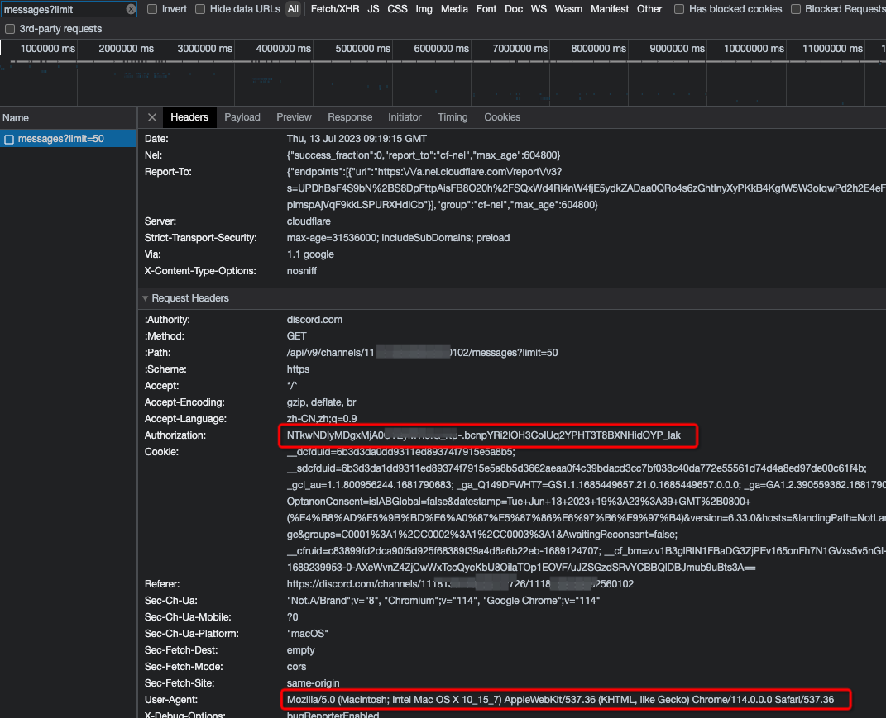

# discord-websocket-client

使用Authorization连接discord的websocket，能够监听所有的相关消息

## 使用说明
1. 进入discord频道，打开network，刷新页面，找到 `messages` 的请求
2. Authorization 即 `userToken`，User-Agent 即 `userAgent`

3. 引入依赖，启动websocket
```java
String userToken = "xxx";
String userAgent = "xxx";
MessageListener messageListener = new MessageListener() {
    @Override
    public void onMessage(JSONObject message) throws Exception {
		System.out.println(message);
	}

    @Override
    public void onClose(int code, String reason) {
		System.out.println("Closed! code: " + code + ", reason: " + reason);
	}
};
UserWebSocketClient client = new UserWebSocketClient(Compression.ZLIB, userToken, messageListener);
client.setUserAgent(userAgent);
try {
    client.connect();
} catch (WebSocketClientStartException e) {
    e.printStackTrace();
}
```
